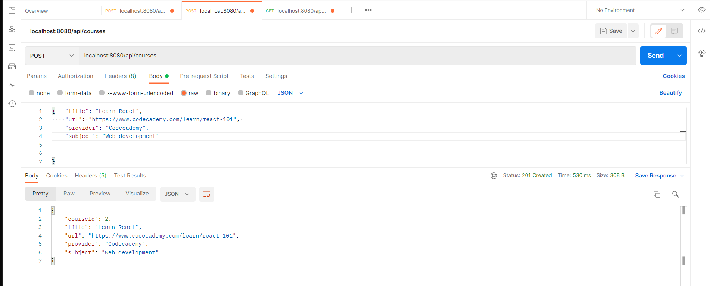

# Reviews-API

The Java application is a REST API that allows users to register using email and password, then save their favorite online programming courses and add a short review. 
Created with Spring Boot and PostgreSQL. 

## Table of contents
* [General info](#general-info)
* [Technologies](#technologies)
* [Future improvement](#future-improvement)
* [Resources](#resources) 

## General info 

The application contains: 
* 3 <b>DAO</b> classes (User, Online Course, Review) 
* <b>GET</b>, <b>POST</b>, <b>PUT</b>, <b>DELETE</b> requests for each of the classes 
API testing was done using Postman. 

## Technologies 
Project is created with: 
* Java version: 11 
* Spring Boot version: 2.7.9
* PostgreSQL version: 1.4.37 

## Future improvement 
* Implement secure authentication using Spring Security 
* Implement unit tests using Mockito 

## Resources 
1. [Building REST services with Spring](https://spring.io/guides/tutorials/rest/) 
2. [Spring @GetMapping, @PostMapping, @PutMapping, @DeleteMapping and @PatchMapping](https://www.javaguides.net/2018/11/spring-getmapping-postmapping-putmapping-deletemapping-patchmapping.html)
3. [Accessing Relational Data using JDBC with Spring](https://spring.io/guides/gs/relational-data-access/)

